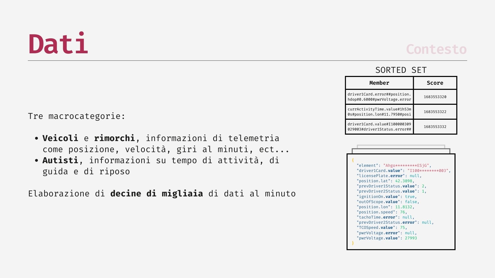

# redis2history
<p align="center" width="100%">
    
</p>

redis2history è uno strumento per l'esecuzione di pipeline ETL (Extract, Transform, Load) utilizzando un approccio modulare e configurabile. Le pipeline sono costituite da stadi (stages), ognuno definito da un plugin modulare, che possono essere eseguiti in parallelo o sequenzialmente.

Questo progetto è stato sviluppato come parte della tesi di laurea triennale in Ingegneria Informatica ed Elettronica presso l'Università di Pavia, in collaborazione con l'azienda Siak Sistemi.

## Installazione ed utilizzo
1. **Installare le dipendenze:**
    ```
    pip install -r requirements.txt
    ```
1. **Lanciare Redis e MongoDB:**
    
    Nel caso non si disponesse di istanze Redis e MongoDB esistenti, è possibile crearne di nuove utilizzando Docker Compose
    ```
    docker compose up
    ```
    Ispezionare il file `docker-compose.yaml` per verificare le porte dei container e la posizione del dump Redis
1. **Configurazione:**
    
    Crea un file di configurazione seguendo la struttura specificata in `config_example.json`
1. **Esegui la pipeline:**

    ```
    python main.py -c <config-file-path>
    ```

## Argomenti di avvio
* `-c`, `--config`: Percorso del file di configurazione (obbligatorio).
* `-m`, `--manual_order`: Esegui le pipeline nell'ordine definito nel file di configurazione.
* `-e`, `--export_run`: Salva i risultati di ogni stage della pipeline su file pickle.
* `-dr`, `--dry_run`: Verifica il file di configurazione e la struttura della pipeline senza eseguire le pipeline.

## Struttura del file di configurazione
* `global`: Definisce variabili globali che possono essere referenziate dai plugin
    
    Gli stage hanno la possibilità di richiedere parametri configurabili, questi vengono prima cercati nei parametri `args`, nel caso non venissero trovati qui, si fa fallback ai parametri specificati in `global`
* `redis`: Definisce i parametri di connessione a Redis, 
    `lock` specifica la chiave a cui applicare il lock, se non è presente il lock non viene impostato
    
    Inoltre, `lock` supporta valori dinamici del tipo:
    * `{{date:<formato>}}`: Data corrente nel formato specificato.
    * `{{env:<nome-variabile>}}`: Valore della variabile di ambiente.
    * `{{global:<nome-variabile>}}`: Variabile globale definita nella configurazione.
* `mongo`: Definisce i parametri di connessione a MongoDB
* `pipelines`: Array di oggetti pipeline con
    * `id`: Identificatore univoco della pipeline.
    * `parallel`: Indica se gli stage della pipeline devono essere eseguiti in parallelo.
    * `source`: Identificativo della pipeline da cui prelevare i dati di ingresso (nella prima pipeline questo campo è nullo o assente).
    * `stages` Array di oggetti stage con
        * `id`: Identificatore univoco dello stage.
        * `script`: Nome dello script del plugin da eseguire.
        * `args`: Argomenti specifici dello stage


## Nel dettaglio: RedisClientProxy e MongoClientProxy

Le classi `RedisClientProxy` e `MongoClientProxy` sono classi proxy utilizzate per esporre i metodi delle rispettive classi client in un'interfaccia sicura per l'utilizzo con multiprocessing. Questo è necessario perché i metodi delle classi `RedisClient` e `MongoClient` potrebbero restituire tipi di dati non serializzabili (non pickable), come iteratori o generatori, che non possono essere passati direttamente tra i processi. Queste classi proxy consentono, se necessario, di trasformare l'oggetto ritornato in un tipo serializzabile sul main thread, prima di essere passati al processo worker

## Nel dettaglio: Downsampling
I plugin di downsampling riducono la frequenza dei dati temporali raggruppando i dati in intervalli di tempo e mantenendo solo il dato più rappresentativo per ogni intervallo. Utilizzando la funzione `group_datetimes` per raggruppare i dati in intervalli di tempo specificati e quindi seleziona il dato più rappresentativo per ogni intervallo.

**Calcolo del dato più rappresentativo**

Per ogni intervallo...
1. Se esistono data point "out of scope", viene selezionato l'ultimo di essi come rappresentante dell'intervallo.
1. Viene calcolato il tempo totale di ciascuno stato all'interno dell'intervallo.
1. Se esiste un "precedente stato", viene aggiunto il tempo di durata del primo dato dello stato all'interno dell'intervallo.
1. Se nell'intervallo esistono altri data point con stato uguale al `prevStatus` del _primo_ data point, allora anche questo contributo viene aggiunto allo stato
1. Viene selezionato il l'ultimo data point con lo stato a durata più lunga all'interno dell'intervallo.

## Unit testing
Gli unit test si trovano nel file `unittests.py` e possono essere eseguiti lanciando il comando
```
python -m unittest unittests
```

## Slides





